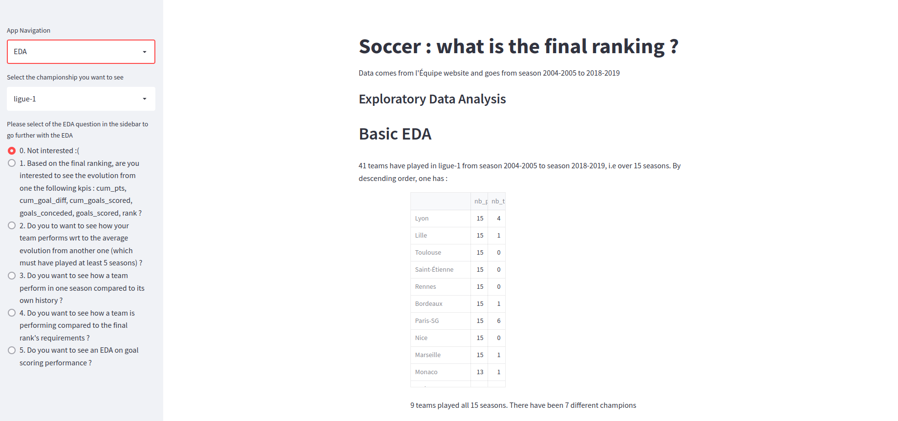
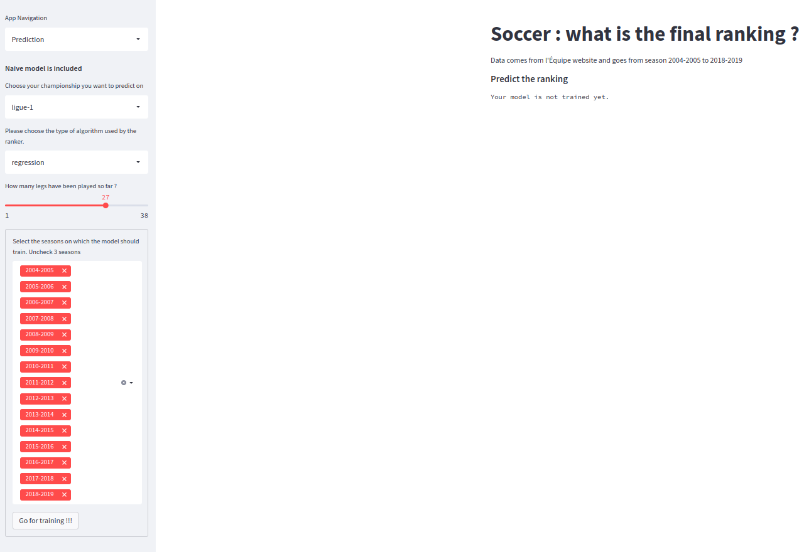
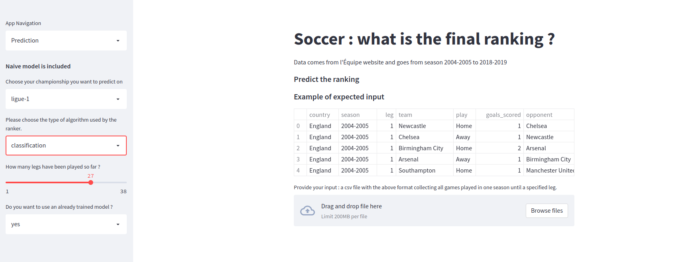
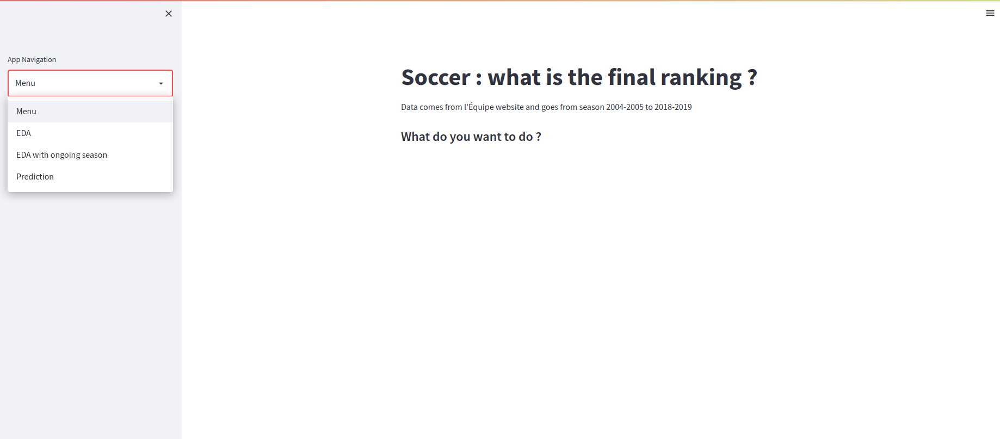

# soccer_season_prediction
The main goal of this project is to predict a soccer final ranking based on what happened until some leg.

Documents (slides and article) related to this project are available in the "documents" directory.

# Introduction

Measures implemented to contain Covid-19 outbreaks impacted all aspect of life. In particular soccer championship had been forced to pause their season. In France, it meant a final stop after 27 full legs and positions were frozen. The decision was met with outrage by clubs that were not in positions they might have been had the season run to its normal end because it had huge consequences for them; from a sportive point of view as well as a financial one.

As a soccer fan and a data scientist, I saw a great opportunity to combine both field in one new original (at least for me!) project : predicting the final ranking given the course of the championship is known up to some leg.

The project is decomposed in 5 steps :
- getting the data
- exploring it and get some insights
- build different type of models and pick the most interesting
- moving the workflow from notebooks to scripts 
- writing an app with Streamlit.

A more detailed description from this project can be found in the article.

# Getting the data

The data used in this project had been scrapped from the website of "L'Équipe", a French newspaper focused on sports.
In particular, one can find all soccer games results since season 2004-2005 for the main championships
(England, Germany, Italy, Spain and France).

In a second step, data from the 2019-2020 season was gathered and set apart since it is only meant as 'new data'.

# Exploratory Data Analysis

Sport related datas are well adapted to analytics tasks. In order to get a sense of the data used, this project 
contains an EDA part where the user can explore the evolution of some soccer kpis depending on the final rank.

Initial exploratory analysis was performed in a Jupyter Notebook in order to get a sense of the data and find out the 
best charts.

Now, a user can simply navigate in the app and choose one of the five options to make his own investigation.


_Screenshot from the EDA Homepage_

# EDA for 2019-2020 season

Here user can see how teams were performing until the championships were paused due to the first Covid-19 
lockdowns. Hence, the user could guess how teams would have performed under "normal circumstances".

# Models
There are several ways one could try to build a model to predict the final ranking. In this work, I tested my ideas
with 1+3 different approaches : naive, regression on points, classification on points evolutions and ranking design 
algorithms (XGBoost Ranker).

Despite that predicting sport outcomes is tough, especially when remaining at a low level such as past results, 
3 mains directions were followed :

1. EDA suggested that, in average, points acquisition is quite linear. So, the first axis to predict the rate of 
point acquisition for the N remaining games. Hence, a predictive approach.
2. Knowing the cumulative number of points after the M-th leg is one part of the picture. Another one is how. Did the 
team perform very well at the beginning of the season and badly the last games or was the team quite regular? So, the 
second direction was to use the cumulative point evolution since the start of the season and compare it to past records.
It is the classification approach
3. Last idea is to use the fact that after every leg, one has an updated ranking. So, the idea is to use the ranking 
structure of the data. This axis was named ... the ranking approach. 

For more details on my choices, readers are encouraged to have a look at the article.

_Screenshot from the prediction page when no model from the expected type is available_


_Screenshot from the prediction page when a model from the expected type is available_

# Notebooks to scripts
Scrapping, first analysis and model building were made in Jupyter Notebooks. Once I deemed the project mature enough, I 
moved to Python files and finally to a Streamlit app 

# The app
In order to illustrate the work done in this project and allow an user-friendly interface for someone else to explore,
I made a Streamlit app. I designed it as a multipage app so that EDA and ML parts are independents but easy to use.

To start the app, one will have to run the following command : 
```commandline
streamlit run soccer_front_app.py
```
Depending on your 
position in your terminal, you may need to update the path to the app script.

Once run, you should land on the following page

_Screenshot from the Homepage_
